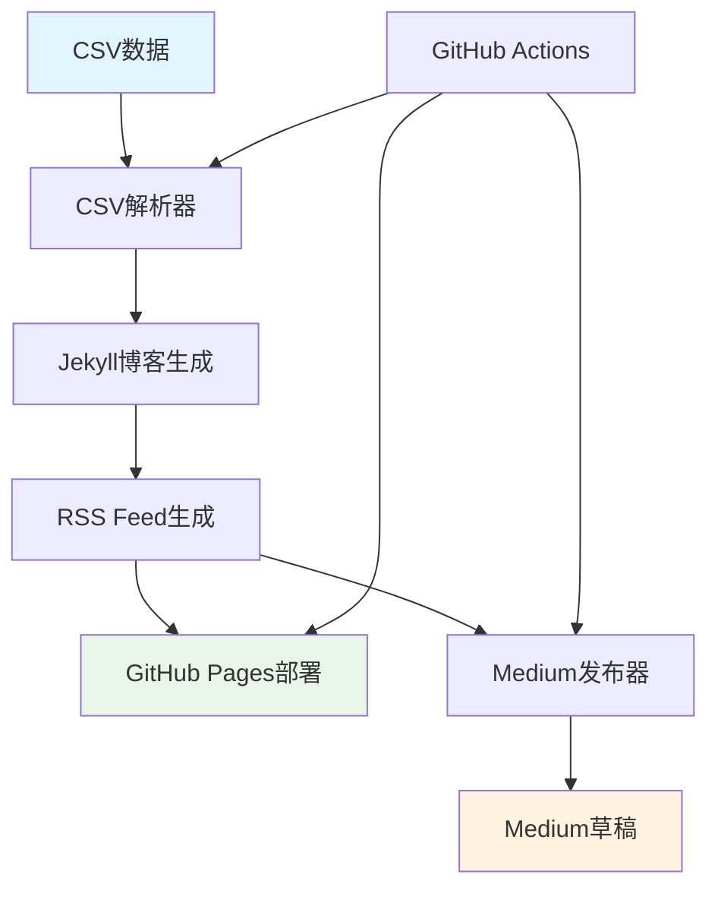

# 📡 RSS到Medium自动发布系统

一个完整的自动化发布系统，可以将CSV数据转换为博客文章，生成RSS Feed，并自动发布到Medium平台。

## ✨ 功能特色

- 🔄 **CSV → Blog → RSS → Medium** 完整自动化流程
- 📝 将CSV数据自动转换为Jekyll格式的博客文章
- 📡 生成标准的RSS 2.0和Atom Feed
- 📤 自动发布新文章到Medium（保存为草稿）
- 🚀 GitHub Actions自动化部署
- 🌐 GitHub Pages静态网站托管

## 🏗️ 系统架构



## 🚀 快速开始

### 1. 克隆项目

```bash
git clone https://github.com/yourusername/rss-to-medium-publisher.git
cd rss-to-medium-publisher
```

### 2. 安装依赖

```bash
npm install
npx playwright install chromium
```

### 3. 配置环境变量

创建 `.env` 文件：

```bash
cp .env.example .env
```

编辑 `.env` 文件：

```env
# 博客配置
SITE_URL=https://yourusername.github.io/rss-to-medium-publisher
RSS_URL=https://yourusername.github.io/rss-to-medium-publisher/feed.xml
BLOG_TITLE=我的技术博客
BLOG_DESCRIPTION=分享技术见解和开发经验
BLOG_AUTHOR=Your Name

# Medium登录信息（可选）
MEDIUM_EMAIL=your_email@example.com
MEDIUM_PASSWORD=your_password

# 运行环境
NODE_ENV=development
```

### 4. 准备CSV数据

将您的CSV文件命名为 `内容库_发布数据@zc_发布情况.csv` 并放在项目根目录。

CSV文件应包含以下列：
- `主题` - 文章标题
- `发布内容` - 文章内容
- `提出人` - 作者
- `标签` - 文章标签（逗号分隔）
- `发布` - 发布状态
- `渠道&账号` - 发布渠道
- `发布完成` - 是否已完成

### 5. 运行系统

```bash
# 生成配置文件模板
npm start config

# 运行完整流程
npm start full

# 仅生成博客和RSS
npm start blog

# 仅发布到Medium
npm start medium

# 检查系统状态
npm start status
```

## 📋 使用说明

### 命令行选项

```bash
npm start [command]
```

| 命令 | 描述 |
|------|------|
| `full` | 运行完整流程：CSV → Blog → RSS → Medium |
| `blog` | 仅生成博客文章和RSS Feed |
| `medium` | 仅发布到Medium |
| `status` | 检查系统状态 |
| `config` | 生成示例配置文件 |
| `help` | 显示帮助信息 |

### CSV数据格式

系统会自动筛选满足以下条件的文章：
- `发布` 字段包含 "进入发布流程"
- `渠道&账号` 字段包含 "medium"
- `发布完成` 字段不等于 "是"

### 生成的文件

```
├── _posts/          # Jekyll格式的博客文章
├── _site/           # 生成的静态网站
├── feed.xml         # RSS 2.0 Feed
├── atom.xml         # Atom Feed
├── _config.yml      # Jekyll配置
├── index.md         # 网站首页
└── published_articles.json  # 已发布文章记录
```

## 🔧 GitHub Actions配置

### 1. 启用GitHub Pages

在GitHub仓库设置中：
1. 转到 **Settings** → **Pages**
2. 选择 **GitHub Actions** 作为源

### 2. 配置Secrets

在 **Settings** → **Secrets and variables** → **Actions** 中添加：

| Secret | 描述 |
|--------|------|
| `MEDIUM_EMAIL` | Medium登录邮箱 |
| `MEDIUM_PASSWORD` | Medium登录密码 |

### 3. 触发条件

GitHub Actions会在以下情况自动运行：
- 推送CSV文件或源代码变更到main分支
- 每天凌晨2点定时运行
- 手动触发workflow

### 4. 运行模式

手动触发时可选择运行模式：
- `blog` - 仅生成博客和RSS
- `full` - 完整发布流程
- `medium` - 仅发布到Medium
- `status` - 系统状态检查

## 📁 项目结构

```
├── src/
│   ├── csvToBlog.js      # CSV到博客转换器
│   ├── rssGenerator.js   # RSS生成器
│   ├── mediumPublisher.js # Medium发布器
│   └── index.js          # 主程序入口
├── .github/workflows/
│   └── publish.yml       # GitHub Actions工作流
├── _posts/               # 生成的博客文章
├── _site/                # 静态网站文件
├── package.json          # 依赖配置
├── .env.example         # 环境变量模板
└── README.md            # 项目说明
```

## ⚙️ 高级配置

### 自定义配置文件

创建 `config.json` 来覆盖默认设置：

```json
{
  "blog": {
    "inputFile": "your-csv-file.csv",
    "outputDir": "_posts",
    "baseUrl": "https://yourdomain.com"
  },
  "rss": {
    "title": "自定义博客标题",
    "description": "博客描述",
    "author": "作者名",
    "postsLimit": 20
  },
  "medium": {
    "rssUrl": "https://yourdomain.com/feed.xml",
    "headless": true
  }
}
```

### Jekyll主题自定义

编辑 `_config.yml` 来自定义Jekyll配置：

```yaml
title: "我的技术博客"
description: "分享技术见解和开发经验"
theme: minima
plugins:
  - jekyll-feed
  - jekyll-sitemap
  - jekyll-seo-tag
```

## 🔍 故障排除

### 常见问题

1. **Medium登录失败**
   - 检查邮箱密码是否正确
   - 确认Medium账号没有启用两步验证
   - 查看浏览器控制台错误信息

2. **CSV解析失败**
   - 检查CSV文件编码是否为UTF-8
   - 确认CSV列名是否匹配
   - 查看控制台错误信息

3. **RSS生成失败**
   - 检查 `_posts` 目录是否存在
   - 确认Markdown文件格式正确
   - 验证Front Matter语法

4. **GitHub Actions失败**
   - 检查Secrets配置是否正确
   - 确认权限设置是否完整
   - 查看Actions运行日志

### 调试模式

设置环境变量启用详细日志：

```bash
export DEBUG=1
export NODE_ENV=development
npm start status
```

## 🤝 贡献指南

欢迎提交Pull Request和Issue！

1. Fork本仓库
2. 创建功能分支 (`git checkout -b feature/amazing-feature`)
3. 提交更改 (`git commit -m 'Add amazing feature'`)
4. 推送到分支 (`git push origin feature/amazing-feature`)
5. 开启Pull Request

## 📄 许可证

本项目采用MIT许可证。详见 [LICENSE](LICENSE) 文件。

## 🔗 相关链接

- [Jekyll官方文档](https://jekyllrb.com/)
- [RSS 2.0规范](https://www.rssboard.org/rss-specification)
- [GitHub Pages文档](https://docs.github.com/en/pages)
- [Playwright文档](https://playwright.dev/)

## 📞 支持

如有问题，请：
1. 查看本README的故障排除部分
2. 搜索已有的[Issues](https://github.com/yourusername/rss-to-medium-publisher/issues)
3. 创建新的Issue描述问题

---

⭐ 如果这个项目对您有帮助，请给个Star支持！ 