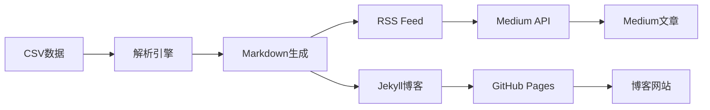

# 📡 RSS到Medium自动发布系统

一个现代化的、基于API的内容发布自动化工具，将CSV数据转换为RSS Feed，并自动发布到Medium平台。

## ✨ 核心特性

- 🚀 **纯API发布**：使用Medium官方Integration Token，无需浏览器自动化
- 📊 **CSV数据源**：从CSV文件自动解析和处理文章内容
- 🌐 **RSS生成**：自动生成符合标准的RSS 2.0和Atom Feed
- 🔄 **智能发布**：去重检测，避免重复发布
- 🎨 **Jekyll集成**：自动生成静态博客站点
- ☁️ **GitHub Actions**：完全自动化的CI/CD流程
- 🔐 **多重认证**：支持Integration Token和Session Token
- 📱 **移动友好**：响应式设计，支持多种设备

## 🏗️ 系统架构



## 🎯 认证方式对比

| 方式 | 持续时间 | 稳定性 | 推荐度 |
|------|----------|--------|--------|
| 🥇 **Integration Token** | 永久有效 | ⭐⭐⭐⭐⭐ | 最推荐 |
| 🥈 **Session Cookie** | 2-6个月 | ⭐⭐⭐⭐ | 备用 |

## 🚀 快速开始

### 1️⃣ 环境准备

```bash
# 克隆项目
git clone <repository-url>
cd medium_final

# 安装依赖 (使用pnpm)
pnpm install

# 复制环境变量模板
cp .env.example .env
```

### 2️⃣ 获取Medium认证

**方法1: Integration Token (推荐)**
```bash
# 获取详细指南
pnpm get-token

# 1. 访问 https://medium.com/me/settings/security
# 2. 滚动到 "Integration tokens" 部分
# 3. 点击 "Get integration token"
# 4. 输入描述并复制token
```

**方法2: Session Cookie (备用)**
```bash
# 登录Medium → F12 → Application → Cookies → 复制sid值
```

### 3️⃣ 配置环境变量

编辑 `.env` 文件：

```env
# 博客配置
SITE_URL=https://yourusername.github.io
BLOG_TITLE=我的技术博客
BLOG_AUTHOR=Your Name

# Medium认证 (选择一种)
MEDIUM_INTEGRATION_TOKEN=your_integration_token_here  # 推荐
# MEDIUM_SESSION_TOKEN=your_session_token_here        # 备用
```

### 4️⃣ 准备CSV数据

将您的文章数据放在 `内容库_发布数据@zc_发布情况.csv` 文件中，格式要求：

| 字段 | 说明 | 示例 |
|------|------|------|
| 标题 | 文章标题 | "如何构建AI代理" |
| 内容 | 文章正文 | Markdown格式内容 |
| 状态 | 发布状态 | "进入发布流程" |
| 发布渠道 | 目标平台 | "Medium,Blog" |
| 发布完成 | 完成标记 | "否" |

### 5️⃣ 运行系统

```bash
# 检查系统状态
pnpm start status

# 生成博客和RSS
pnpm start blog

# 发布到Medium
pnpm start medium

# 完整流程
pnpm start full
```

## 🛠️ 详细使用说明

### 命令详解

```bash
# 系统命令
pnpm start status    # 检查系统状态和配置
pnpm start blog      # 仅生成博客和RSS
pnpm start medium    # 仅发布到Medium
pnpm start full      # 完整发布流程

# 工具命令
pnpm get-token      # 获取Medium token指南
pnpm serve          # 本地预览博客 (http://localhost:8080)
```

### 配置选项

**博客配置**
```env
BLOG_TITLE=技术博客
BLOG_DESCRIPTION=Context Engineering and AI Development Blog
BLOG_AUTHOR=Blog Author
SITE_URL=https://yourblog.github.io
RSS_URL=https://yourblog.github.io/feed.xml
```

**Medium配置**
```env
# 方法1: Integration Token (推荐)
MEDIUM_INTEGRATION_TOKEN=your_token_here

# 方法2: Session Token (备用)
MEDIUM_SESSION_TOKEN=your_session_id
MEDIUM_USER_ID=your_user_id
```

**高级配置**
```env
ALLOW_REPUBLISH=false      # 是否允许重新发布
NODE_ENV=production        # 运行环境
```

## 🤖 GitHub Actions 自动化

系统支持完全自动化的发布流程：

### 触发条件
- 📝 CSV文件有变化时自动触发
- ⏰ 每天凌晨2点定时检查
- 🖱️ 手动触发 (支持不同模式)

### 运行模式
- `full`: 完整发布流程
- `blog`: 仅生成博客
- `medium`: 仅发布到Medium  
- `status`: 检查系统状态

### 设置Secrets

在GitHub仓库的 Settings → Secrets 中添加：

```bash
MEDIUM_INTEGRATION_TOKEN   # Medium Integration Token
# 或者
MEDIUM_SESSION_TOKEN       # Medium Session Token
MEDIUM_USER_ID            # Medium用户ID
```

## 📊 监控和维护

### 系统状态检查

```bash
pnpm start status
```

输出示例：
```json
{
  "csv": { "exists": true, "path": "内容库_发布数据@zc_发布情况.csv" },
  "posts": { "count": 5, "dir": "_posts" },
  "rss": { "exists": true, "stats": { "totalPosts": 5 } },
  "medium": { "configured": true, "stats": { "totalPublished": 3 } }
}
```

### 故障排除

**认证问题**
```bash
# 检查token有效性
pnpm start medium

# 重新获取token
pnpm get-token
```

**发布问题**
```bash
# 查看发布历史
cat published_articles.json

# 清除发布历史 (重新发布)
rm published_articles.json
```

## 🔐 安全最佳实践

1. **Token管理**
   - 使用Integration Token而非Session Cookie
   - 定期轮换token (建议3个月)
   - 不要在代码中硬编码token

2. **访问控制**
   - 使用GitHub Secrets存储敏感信息
   - 限制仓库访问权限
   - 监控token使用情况

3. **备份策略**
   - 定期备份CSV数据
   - 保存多个有效token
   - 监控发布状态

## 📈 性能优化

- ✅ **纯API调用**：比浏览器自动化快10倍
- ✅ **并发处理**：支持批量文章发布
- ✅ **智能缓存**：避免重复处理
- ✅ **增量更新**：只处理变化的内容
- ✅ **错误恢复**：自动重试失败的操作

## 🤝 贡献指南

1. Fork 项目
2. 创建特性分支 (`git checkout -b feature/amazing-feature`)
3. 提交更改 (`git commit -m 'Add amazing feature'`)
4. 推送分支 (`git push origin feature/amazing-feature`)
5. 创建 Pull Request

## 📄 许可证

MIT License - 详见 [LICENSE](LICENSE) 文件

## 💡 常见问题

**Q: Token多久会过期？**
A: Integration Token永久有效；Session Token通常2-6个月

**Q: 可以同时发布到多个平台吗？**
A: 目前专注于Medium，未来可能支持更多平台

**Q: 支持哪些CSV编码？**
A: 支持UTF-8和GBK编码的CSV文件

**Q: 如何自定义文章格式？**
A: 修改 `src/csvToBlog.js` 中的模板配置

---

📞 **需要帮助？** 创建 [Issue](../../issues) 或查看 [Wiki](../../wiki) 